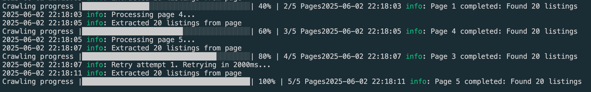

# Web scrapping property listings in district 3 and 5

## Background

This mini project allows us to scrap property listing data from [PropertyGuru](https://www.propertyguru.com.sg/). In this scenario, we will look at the private condominum listings of 2 of the most popular district in Singapore (District 3 and 5)

For other deliverables such as the technical design description and summary report, refer to:

- [Technical Design](./report/report.md)
- [Summary Report](./report/summaryReport.md)
- [Extracted Data](./report/extractedData.json)

## Installation

Clone the repository

```bash
git clone https://github.com/deming16/legendary-lamp
```

Install the npm packages

```bash
npm install
```

## Usage

Run the crawler

```bash
npm start
```

The scrapping process should start



## Configuration

You can customize the crawler behavior by editing the `config.json` file

### Example Configuration

You can make some adjustments to the configuration of the crawler as well if you want to

- `pages`: How many pages to scrap
- `delay`: The delay before the next new request is made (in ms)
- `retries`: How many times to retry when a request is failed
- `concurrency`: How many request to allow to submit at one time
- `params`: These are the url query params to inject into PropertyGuru's url. By default we are requesting for all condo listings in district 3 and 5 for the purpose of our mini example

```json
{
  "params": {
    "listingType": "sale",
    "propertyTypeGroup": "N",
    "propertyTypeCode": "CONDO",
    "isCommercial": "false",
    "districtCode": ["D03", "D05"]
  },
  "pages": 50,
  "delay": 500,
  "retries": 10,
  "concurrency": 2
}
```

## Output

The crawler will save extracted data to the specified output directory (default: `./data`) in JSON format.
