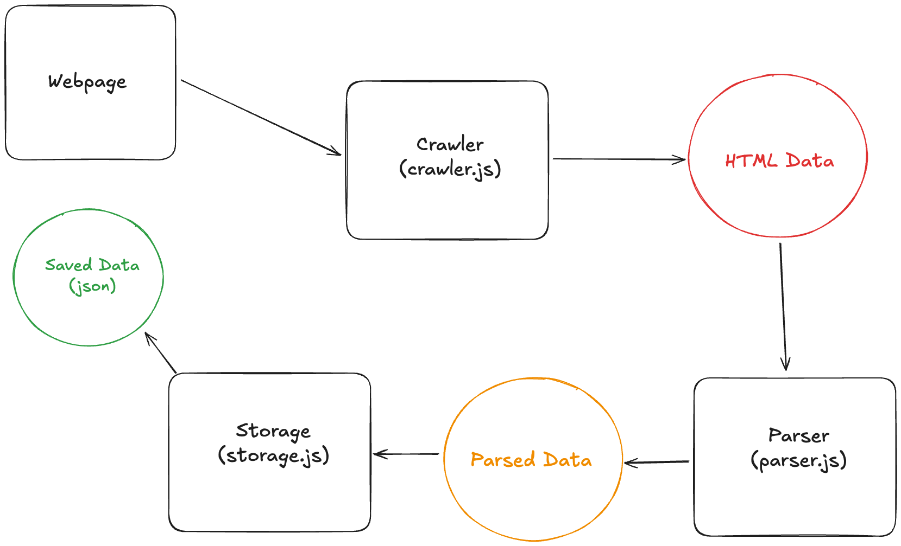
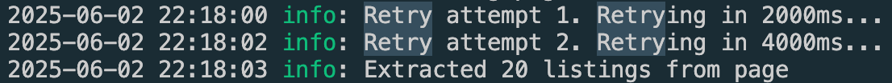

# Web scrapping property listings in district 3 and 5

## Background

This mini project allows us to scrap property listing data from [PropertyGuru](https://www.propertyguru.com.sg/). In this scenario, we will look at the private condominum listings of 2 of the most popular district in Singapore (District 3 and 5)

## Technical Design

### Overview

The web scraper will perform its task in the following steps:

1. Retrieval of the raw HTML of the page
2. Parsing of the HTML into the data schema that we want
3. Storing of the final data into a json file

Each of the steps will be handled by the respective services: `crawler`, `parser` and `storage`



### Retrieval of the raw HTML of the page

In order to parse and store the scrapped data, we need to first crawl and gather the html content. To get the HTML content, we simply construct the url with necessary query params to access the page that we want to scrape the data from.

We will be using the `cheerio` package to get the HTML content

#### Pagination

As PropertyGuru's search results are paginated, we will have to get the data from every page. PropertyGuru's supports page query param in its url, so we can submit a `page` param when constructing the url to iterate and get the results from each page.

Page 1 with `page=1`:

```
https://www.propertyguru.com.sg/property-for-sale?listingType=sale&propertyTypeGroup=N&propertyTypeCode=CONDO&isCommercial=false&districtCode=D03&districtCode=D05
```

Page 2 with `page=2`:

```
https://www.propertyguru.com.sg/property-for-sale?districtCode=D03&districtCode=D05&isCommercial=false&listingType=sale&propertyTypeCode=CONDO&propertyTypeGroup=N&page=2
```

#### Handling rate limiting

PropertyGuru will start to block request from our IP and return a 403 error if the requests are made too quickly. To mitigate this, we will simply increase the timeout between request.

If it still fails after the delay then we will retry with exponential backoff (i.e the retry delay will increase with each subsequent retry)

```js
// Configure retry behavior
axiosRetry(client, {
  retryDelay: (retryCount) => {
    // Time to next retry increases exponentially
    const delay = Math.pow(2, retryCount) * 1000;
    logger.info(`Retry attempt ${retryCount}. Retrying in ${delay}ms...`);
    return delay;
  },
  //...
});
```



#### Dynamically loaded content

PropertyGuru's search results are not dynamically loaded so we can simply get all the information in the HTML content using `cheerio`. But if in the future PropertyGuru were to switch to dynamically loaded content using JS for instance, We can using a headless browser like `puppeteer` to load and wait for all the content to be loaded first before then using `cheerio` again to get the HTML content.

Below shows a simple example of how `puppeteer` and `cheerio` can be used together to handle dynamically loaded content.

```js
// Launch the browser
const browser = await puppeteer.launch();
const page = await browser.newPage();

// Navigate to the dynamic website
await page.goto("https://example.com");

// Wait for necessary elements to load using Puppeteer's waitForSelector or other wait functions
await page.waitForSelector("#dynamic-content");

// Get the page HTML content
const content = await page.content();

// Close the browser
await browser.close();

// Load the HTML content into Cheerio
const $ = cheerio.load(content);

// Now you can use Cheerio to parse the page
$("#dynamic-content").each((index, element) => {
  console.log($(element).text());
});
```

### Parsing of the HTML content

Once we have the HTML content, we can then use `cheerio` to query select the relevant parts of the HTML and then parse it accordingly by writing our own logic.

#### Data Schema

Our data will contain the most important basic information such that it allows us to get some insights on the current condo listings in the 2 districts

- `id`: Unique identifier for the listing set by PropertyGuru
- `url`: Link to the listing page on PropertyGuru
- `title`: The project name
- `address`: The address of the condominum block
- `price`: The asking price for the unit
- `bedrooms/bathrooms`: The number of bedrooms and bathrooms the unit has
- `area`: The size of the unit in sqft
- `psf`: The price per square foot of the unit
- `agentName`: The seller agent's name
- `agentUrl`: The seller agent's profile link on PropertyGuru

```json
{
  "id": "25503699",
  "url": "https://www.propertyguru.com.sg/listing/for-sale-normanton-park-25503699",
  "title": "Normanton Park",
  "address": "49 Normanton Park",
  "price": "S$ 2,050,000",
  "bedrooms": "3",
  "bathrooms": "2",
  "area": "969 sqft",
  "psf": "S$ 2,115.58 psf",
  "agentName": "Michael Lu",
  "agentUrl": "/agent/michael-lu-10738542",
  "timestamp": "2025-06-02T05:48:48.385Z"
}
```

### Storing of final data

After all the data are parsed, we will then simply output them into a json file which can then be used for analysis later on. The code logic for this service are all in `storage.js`
